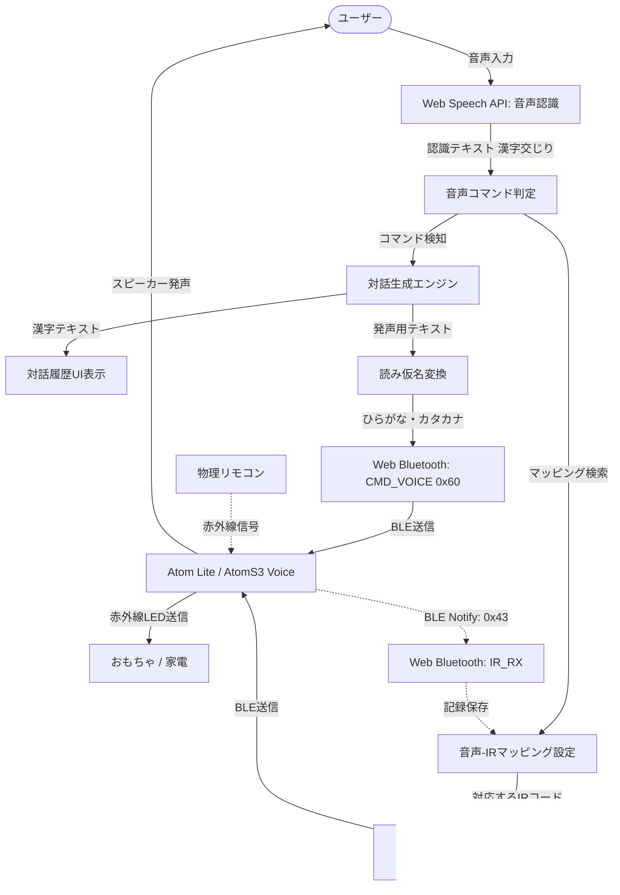

# Voice Control Toy Implementation Plan

本プロジェクトは、M5Stack Atom Lite / AtomS3 (Voice機能付きファームウェア) を搭載したおもちゃを、Google Chrome上のWeb BluetoothおよびWeb Speech APIを利用して「声」で赤外線コントロールし、同時に対話（双方向のコミュニケーション）を実現するローカル完結型のWebシステムを構築する計画です。

スマートフォン（Android Chrome等）での操作も想定し、タッチ操作に最適化された**レスポンシブデザイン**を採用します。

---

## 1. 全体アーキテクチャと処理フロー

### 処理の順序 (シーケンス)
1. **音声認識**: ユーザーが「テレビをつけて」と発話する。
2. **コマンド判定 & マッピング検索**:
   - 認識したテキスト（例:「テレビをつけて」）が、登録済みの**音声-IRマッピング**の正規表現パターン（例: `テレビ.*(つけ|オン)`）にマッチするか判定。
   - マッチした場合、紐づけられている赤外線コード（例: `tv_power`）を特定。
3. **赤外線送信**: `localStorage` に保存された赤外線コードデータ（RAW timings またはプロトコルデータ）を読み込み、Web Bluetooth経由で `CMD_IR_SEND` を送信。
4. **対話生成**: 「テレビをつけますね！」という応答テキストと、「てれびおつけますね」という読み仮名データを生成。
5. **音声認識の一時停止**: ハウリング（自身の発声をマイクが拾うこと）を防ぐため、音声認識を一時的にポーズ。
6. **音声送信と発声**: 読み仮名を `CMD_VOICE` (0x60) でAtomに送信し、Atomに喋らせる。
7. **音声認識の再開**: 発声完了後（または一定時間後）、音声認識を自動的に再開。

---

## 2. コア機能の設計

### ① Web Bluetooth (Web BT) 接続
- `control.js` の接続処理を再利用し、自動再接続、サービス/キャラクタリスティックの取得を安全に実施。
- 対象キャラクタリスティック:
  - `CMD_CHAR_UUID` (書き込み用 - `CMD_VOICE` / `CMD_IR_SEND`)
  - `STS_CHAR_UUID` (コマンド応答通知用)
  - `CFG_CHAR_UUID` (ファーム情報取得用)
  - `IR_RX_CHAR_UUID` (赤外線学習用)

### ② JSで音声認識 (SpeechRecognition)
- Chromeの `webkitSpeechRecognition` を使用。
- モバイル環境（Android Chrome）でも動作するように安定したエラーハンドリングとマイク権限のガイダンスを実装。
- `continuous = true` に設定し、ハンズフリーで連続対話ができるようにします。

### ③ 赤外線リモコン記録（学習）機能（オプショナル）
- **オプショナル設計**: デバイスのCFGで `ir_rx` が検出された場合に自動有効化。未接続の場合はUI上でスキップ可能であることを明示。
- **学習フロー**:
  1. UIの「赤外線学習開始」ボタンを押し、Atomに `CMD_IR_RX_START` (0x41) を送信。
  2. 物理リモコンをAtomの赤外線レシーバーに向けて操作。
  3. `IR_RX_CHAR_UUID` の Notify で受信データを取得し、名前（例: `tv_power`）を付けて `localStorage` に保存。
  4. UIから `CMD_IR_RX_STOP` (0x42) を送信して学習を停止。

### ④ 音声-IRマッピング編集機能
- 保存された赤外線コードと、音声トリガー（キーワード / 正規表現）、および応答音声（漢字・ひらがな）のマッピングを自由に追加・編集・削除できるUIを提供。
- マッピングデータは `localStorage` に自動で永続化されます。

### ⑤ JSで読み仮名変換
- 応答テキスト（漢字）からひらがなへの「高品質な読み仮名」の変換を行うため、対話生成時に `{ text: "テレビをつけます", yomi: "てれびおつけます" }` のような静的マップを用意。
- 動的な変換（辞書にない未知の語句）に対しては、JS内の「簡易漢字 $\rightarrow$ ひらがな置換マップ」および「数字 $\rightarrow$ ひらがな（例: 1 $\rightarrow$ いち）」変換ロジックを実装。
- 半角カタカナ/ひらがな以外の文字を排除するクレンジング処理を実装。

---

## 3. レスポンシブUI/UXデザイン（PC・スマホ対応）

PCの広大な画面でも、スマホの縦長画面でも極上のユーザー体験を提供する**レスポンシブ・グラスモルフィズムスタイル**を採用します。

### 📱 モバイル（スマホ）対応設計
- **タッチターゲットの最適化**: すべてのインタラクティブな要素（ボタン、フォーム、選択リスト）は、指での誤タップを防ぐため、**最小高さ 44px** を確保し、十分な間隔を空けます。
- **レイアウトの流動的配置（CSS Grid & Flexbox）**:
  - PC環境: 画面中央にボイス球体を配置し、左右に「対話フィード」と「設定/マッピングエディタ」を配置するマルチカラムレイアウト。
  - スマホ環境: 画面幅に応じて、ボイス球体が最上部に配置され、その下に「対話フィード」、「赤外線学習＆マッピングエディタ」が1カラムで縦一列に美しくスタックされるレイアウト。
- **ホログラフィック・ボイス球体**: スマホの画面幅に合わせて球体のサイズを自動調整（`max-width: 200px` 等）し、表示領域を圧迫しないようにします。
- **モーダル/アコーディオン**: 設定パネルはスマホ画面で折りたたみ可能（アコーディオンUI）にし、対話ログが常にメインで確認できるように配慮します。

### 💎 ビジュアルエフェクト (Rich Aesthetics)
- **サイバーパンク・グラデーション**: ミッドナイトブラックの背景に、ネオンシアン（BLE接続状態）、バイオレット（マイク有効時）、マゼンタ（赤外線送信・発声時）のグロー（光彩）エフェクトを適用。
- **球体のアニメーション**: 音声認識のステータスに合わせて脈動する3D風グラデーション球体。

---

## 4. 開発・検証ロードマップ

1. **ステップ 1: 本計画ファイルの出力（完了）**
2. **ステップ 2: `docs/voice_control.html` の作成**
   - モバイル対応メタタグの設定、CSSによるレスポンシブ・グラスモルフィズムスタイルの定義。
3. **ステップ 3: `docs/voice_control.js` の作成**
   - 音声認識、マッピングのCRUD（追加・編集・削除）処理、BLE通信、読み仮名変換ロジックの実装。
4. **ステップ 4: インデックスファイルの更新**
   - `docs/index.html` に音声コントロールページへのリンクを美しく追加。
